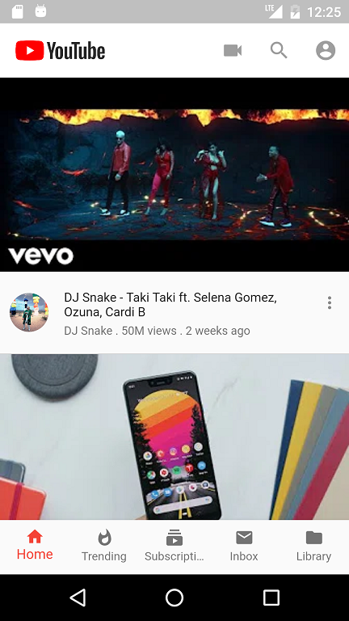
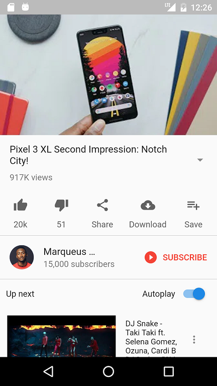
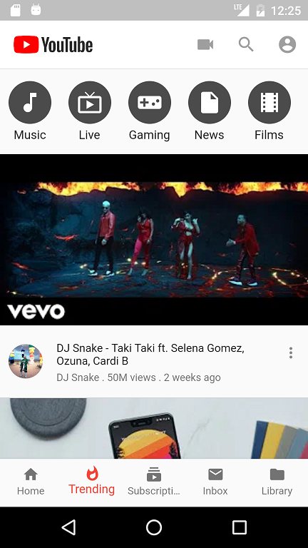
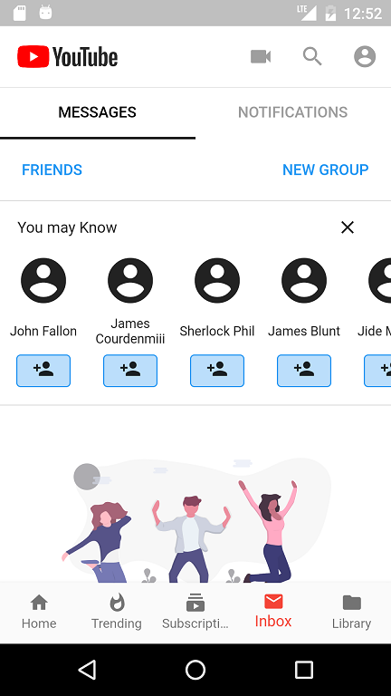
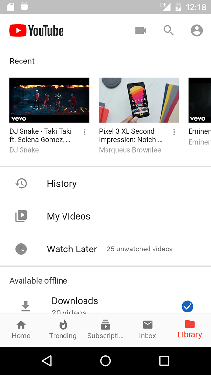
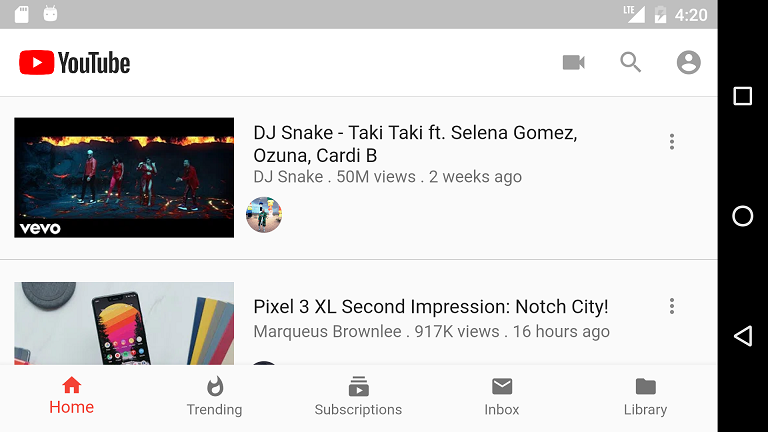

# flutter_youtube_ui

A Flutter application to showcase different UI features of the flutter sdk.

## Tutorial Link
Watch as i guide you step by step on how to build these interfaces and more. YouTube Playlist [here](https://www.youtube.com/watch?v=zSqicZ8Ky7A&list=PLkf3n4moMnEBLOE-BU2ESbZtZqIKRKJwU)

## Screenshots

     

## Getting Started

For help getting started with Flutter, view our online
[documentation](https://flutter.io/).
